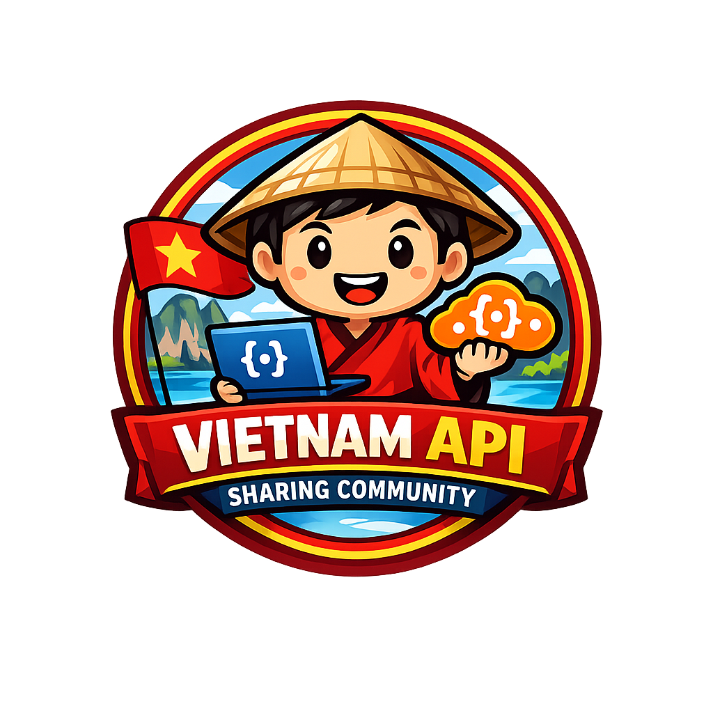
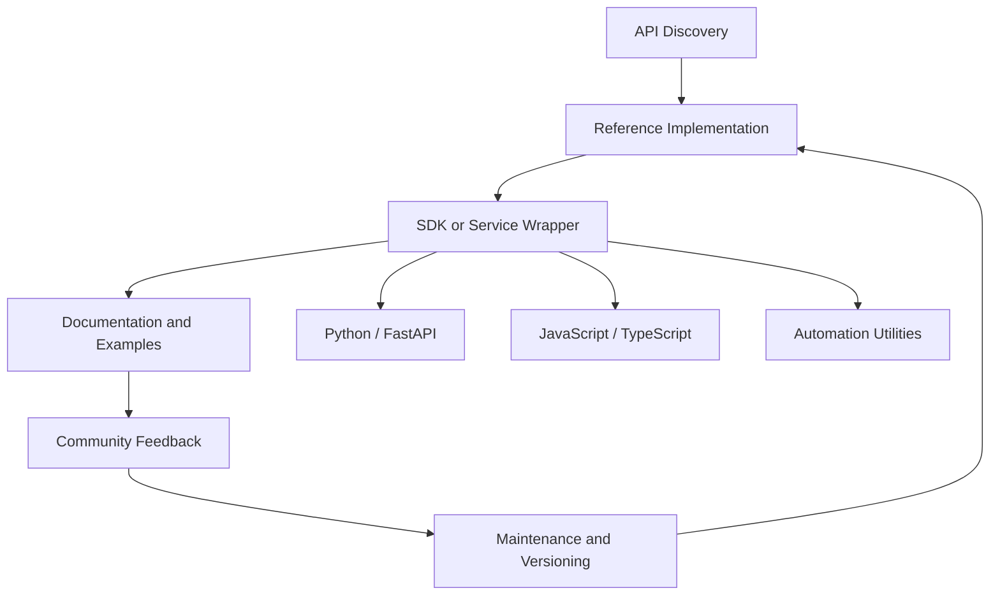

# Vietnam API Sharing Community

### Open API References, Integration SDKs, Banking Automation, and Developer Enablement for Vietnam

  
  
  

  
  
  
  

---

## Executive Overview

**Vietnam API Sharing Community** is a community-oriented open-source organization for developers who build, document, share, and improve API integrations, SDKs, automation utilities, and reference implementations across Vietnam.

The organization focuses on practical API assets: banking integration examples, Python/FastAPI services, TypeScript SDKs, JavaScript automation, REST implementation references, CAPTCHA/automation helpers, and reusable documentation for developers and technical teams.

> The mission is to reduce duplicated integration effort by turning real-world API knowledge into structured, transparent, reusable, and community-reviewable open-source assets.

---

## Strategic Positioning

| Community thesis | Execution signal |
|---|---|
| **APIs are core digital infrastructure** | Provide reusable references for banking, fintech, automation, and integration-heavy product teams. |
| **Developers need practical examples** | Publish Python, JavaScript, TypeScript, FastAPI, and SDK-style implementations that can be studied and adapted. |
| **Integration quality improves through transparency** | Use open repositories to document behavior, patterns, errors, workflows, and implementation details. |
| **Vietnam needs shared technical assets** | Build a local developer knowledge base around APIs, automation, and digital service integration. |
| **Community distribution compounds value** | Encourage contribution, review, issue reporting, and reusable templates for future integrations. |

---

## Platform Pillars

<table>
<tr>
<td width="50%" valign="top">

### Banking & Fintech API References

- Public examples for Vietnamese banking integrations.
- Python SDKs and implementation references.
- TypeScript packages for integration workflows.
- FastAPI service references.
- Authentication, request signing, and workflow examples.

</td>
<td width="50%" valign="top">

### API Tooling & Automation

- REST API examples and documentation.
- CAPTCHA and automation utilities.
- Request/response modeling patterns.
- Operational scripts for integration testing.
- Developer productivity assets.

</td>
</tr>
<tr>
<td width="50%" valign="top">

### Open Documentation

- Practical README-first implementation notes.
- Example-driven developer onboarding.
- Repository-level integration guides.
- Community issue tracking and improvement feedback.
- Repeatable setup and usage instructions.

</td>
<td width="50%" valign="top">

### Community Enablement

- Shared API knowledge base for Vietnam developers.
- Cross-language implementation references.
- Open-source learning resources.
- Integration patterns for startups and technical teams.
- Maintained public examples for real-world workflows.

</td>
</tr>
</table>

---

## Technology Stack & Domain Expertise

| Domain | Capability signals |
|---|---|
| **Banking integrations** | OCB, MSB, MB Bank, LPBank, Eximbank, ACB, NCB, Bac A Bank, Nam A Bank, and related reference workflows. |
| **SDK development** | Python packages, TypeScript modules, JavaScript utilities, request abstractions, and reusable client patterns. |
| **API services** | FastAPI implementations, REST service wrappers, authentication flows, request/response modeling, and examples. |
| **Automation** | CAPTCHA utilities, integration testing scripts, workflow automation, and developer tooling. |
| **Documentation** | README-first guidance, integration examples, setup steps, usage references, and community-maintained notes. |

---

## Generated Dynamic Profile Intelligence

<!-- ORG-PROFILE-METRICS:START -->

> This generated section is designed to refresh automatically from GitHub repository data. It tracks public repositories, language coverage, API implementation patterns, and high-signal community projects.

### Real-time organization signals

| Signal | Value |
|---|---:|
| Public repositories | **22** |
| Primary engineering lane | **API integrations and SDK references** |
| Top repository languages | **Python · JavaScript · TypeScript · HTML** |
| Community focus | **Banking APIs · FastAPI services · SDKs · automation tools** |
| Automation model | **Scheduled GitHub Actions + live README widgets** |

### Strategic repositories

| Repository | Engineering signal |
|---|---|
| [`ocb_python`](https://github.com/Viet-Nam-API-Sharing-Community/ocb_python) | OCB integration reference for Python developers. |
| [`ocb_biz_python-v2`](https://github.com/Viet-Nam-API-Sharing-Community/ocb_biz_python-v2) | OCB business banking Python implementation reference. |
| [`msb_python`](https://github.com/Viet-Nam-API-Sharing-Community/msb_python) | MSB banking integration reference. |
| [`mbbank_biz_python`](https://github.com/Viet-Nam-API-Sharing-Community/mbbank_biz_python) | MB Bank business banking integration reference. |
| [`lpbank`](https://github.com/Viet-Nam-API-Sharing-Community/lpbank) | LPBank TypeScript SDK and integration package. |
| [`acbbank-python`](https://github.com/Viet-Nam-API-Sharing-Community/acbbank-python) | FastAPI service for ACB banking integration workflows. |
| [`Api-Mbbank-Biz`](https://github.com/Viet-Nam-API-Sharing-Community/Api-Mbbank-Biz) | Automated banking integration reference implementation. |
| [`bank-captcha`](https://github.com/Viet-Nam-API-Sharing-Community/bank-captcha) | CAPTCHA and automation tooling for API workflows. |

Dynamic metrics are updated by the repository workflow in `.github/workflows/profile-metrics.yml` after deployment.

<!-- ORG-PROFILE-METRICS:END -->  

---

## Community Model

---

## Contact

| Channel | Link |
|---|---|
| GitHub | [github.com/Viet-Nam-API-Sharing-Community](https://github.com/Viet-Nam-API-Sharing-Community) |
| Community website | [community.com.vn](https://community.com.vn) |
| Parent company | [photuesoftware.com](https://photuesoftware.com) |
| Cloud organization | [HiTechCloud](https://github.com/hitechcloud-vietnam) |
| AI organization | [HiTechAI VN](https://github.com/HiTechAI-VN) |

---

### Shared API knowledge for Vietnam developers, integration teams, and open-source builders

